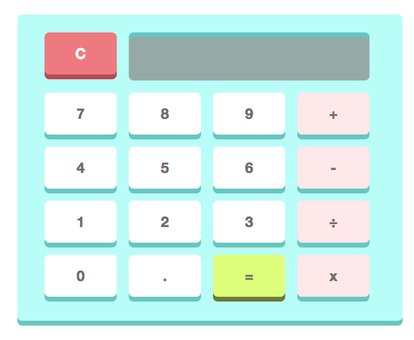

# Simple Calculator

## Introduction

A simple calculator implementation handling adding, subtracting, multiplying, and dividing of both whole and decimal numbers. This currently does NOT follow operator precedence (it calculates left to right).

[VIEW IT LIVE](https://mihhuynh.github.io/simple-calculator/)

## Getting Started

You can view it online via this link: [https://mihhuynh.github.io/simple-calculator/](https://mihhuynh.github.io/simple-calculator/)

Or, if you would like to run it locally:

### Prerequisites

The only dependences that this solution has are:

* HTML
* (plain) CSS
* (vanilla) JavaScript

### Installing

Clone and `cd` into the directory via the terminal.

```
git clone https://github.com/MiHHuynh/simple-calculator.git
cd simple-calculator
```

Files will be in this structure:

```
.
├── README.md
├── index.html
├── reset.css
├── script.js
└── style.css
```

Open the `index.html` file in your browser. For example:

```
file:///Users/<USERNAME>/<DIRECTORY CONTAINING CLONED REPO>/simple-calculator/index.html
```

## Functionality

Input will take as many digits per number and as many concatenated chunks of number and operation as desired. The result is shown on the display screen when an expression is fully ended with a hit of the equal sign button.



[VIEW IT LIVE](https://mihhuynh.github.io/simple-calculator/)

## Moving Forward

To further extend functionality of this widget, I would like to implement the following things in the future:

* Testing (unit tests, integration tests, etc.)
* Caching of previous calculations (perhaps via localStorage)
* Operator precendence/PEMDAS
* Tying in keyboard events to allow the user to type in the input

## Built With

* HTML
* CSS
* JavaScript

## Acknowledgments

* CSS Reset v2.0, courtesy of [Meyerweb.com](http://meyerweb.com/eric/tools/css/reset/). Details in the `reset.css` file.